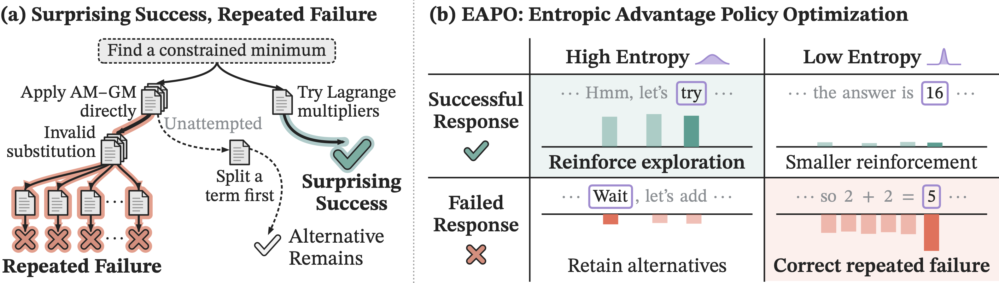

# EAPO: Entropic Advantage Policy Optimization

<a href="https://arxiv.org/abs/2609.33781"></a>
<a href="https://eapo-explore.github.io"></a>
<a href="https://www.python.org/downloads/release/python-3130/"></a>

> Welcome to the official repository of "Surprising Success, Repeated Failure: Entropy-Guided Credit Assignment for Exploration in LLM Reasoning"!

**EAPO** (Entropic Advantage Policy Optimization) is an entropy-guided credit-assignment method for exploration in LLM reasoning. It redistributes each response's advantage across tokens, assigning stronger penalties to low-entropy tokens in negative-advantage responses to correct repeated failures and greater credit to high-entropy tokens in positive-advantage responses to reinforce exploration, while attenuating penalties at uncertain positions to preserve opportunities for recovery.



---

## 🚀 Get Started

We recommend using [uv](https://docs.astral.sh/uv/) to set up the environment. Dependencies are specified in `pyproject.toml` and pinned in `uv.lock`.

### 1. Clone the Repository

```sh
git clone https://github.com/wgcyeo/EAPO.git
cd EAPO
```

### 2. Install Dependencies

After [installing uv](https://docs.astral.sh/uv/getting-started/installation/), run:

```sh
uv sync
source .venv/bin/activate
```

### 3. Set Environment Variables

Copy the environment template:

```sh
cp .env.example .env
```

For W&B logging, set `WANDB_PROJECT` in `.env` and run `wandb login`. To disable logging, set `REPORT_TO=none` in `.env`.

## 🏋️ Training

Train EAPO with:

```sh
bash scripts/run_train_eapo.sh <MODEL_NAME>
```

Replace `<MODEL_NAME>` with a Hugging Face model ID or local model directory, such as `Qwen/Qwen3-4B-Base`.

To train the GRPO baseline:

```sh
bash scripts/run_train_grpo.sh <MODEL_NAME>
```

Trained adapters and checkpoints are saved to `outputs/<run_name>/`.

#### Options

```sh
--eapo-kappa <value>   # EAPO weighting strength (default: log(4); 0 for uniform credit)
--learning-rate <lr>   # Learning rate (default: 1e-5)
--max-steps <n>        # Training steps (default: 200)
```

For all options, run `bash scripts/run_train_eapo.sh --help`.

## 📊 Evaluation

Evaluate a base model or local LoRA adapter on AIME, HMMT, AMC23, and MATH500 with:

```sh
bash scripts/eval.sh <MODEL_OR_PATH>
```

Use a model ID or the trained adapter directory, such as `outputs/<run_name>`. Evaluation datasets are downloaded automatically.

#### Options

```sh
--datasets <names>         # Benchmarks to evaluate, e.g. AIME24,HMMT26
--max-new-tokens <n>       # Maximum response length (default: 16384)
```

Evaluation reports avg@32 and pass@32 from 32 responses per problem. Scores and responses are saved to `results/<model_or_run_name>/`.

## 📖 Citation

If you find EAPO useful in your research, please cite our paper:

```bibtex
@article{yeo2026eapo,
  title   = {Surprising Success, Repeated Failure: Entropy-Guided Credit Assignment for Exploration in {LLM} Reasoning},
  author  = {Yeo, Woongyeong and Kang, Minki and Lee, Chanuk and Park, Sangwoo and Baek, Jinheon and Hwang, Sung Ju},
  journal = {arXiv preprint arXiv:2609.33781},
  year    = {2026}
}
```
